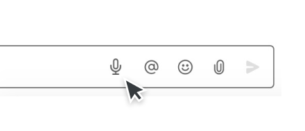

# Voice Messages for Slack

> Record a voice message and send it to anyone inside Slack.

## Install

Install this extension from [Chrome Web Store](https://chrome.google.com/webstore/category/extensions).

## Usage

After you install this extension, a new button with a microphone icon will be added to the message bar in Slack.

1. Click the button with a microphone
2. Allow this extension to use your microphone (you only need to do this once)
3. Record your voice message
4. Drag & drop downloaded audio file into a dialog in Slack
5. Send message

Your recordings aren't sent anywhere and are only stored locally on your machine.
